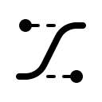

<!-- markdownlint-disable-next-line -->
<p align="center">
  <a href="#" rel="noopener" target="_blank"></a>
</p>

<h1 align="center">Easing Functions</h1>

<div align="center">

*Available for C++, C#, Python, Unreal Engine and Unity*
  
</div>

#

<div align="center">

[](https://github.com/mrrobinofficial/easing/blob/HEAD/LICENSE.txt)


</div>

## Quick guide

This repo is a comprehensive collection of easing functions that can be utilized in different programming languages and game development frameworks. The repository provides a set of easing functions designed to facilitate smooth and gradual transitions between values, commonly used in animation systems, user interface interactions, and other scenarios that require smooth motion.

Benefits and Use Cases:
- Smooth Transitions: The easing functions provided in this repository enable developers to achieve smooth and gradual transitions between values, allowing for more visually appealing animations and movements.
- Animation Systems: The easing functions can be integrated into animation systems to control the interpolation between keyframes, resulting in more natural and fluid animations.
- User Interface Interactions: These easing functions can enhance user interface interactions by providing smooth transitions in response to user input, such as button clicks or slider adjustments.
- Game Development: The repository's support for Unreal Engine and Unity makes it valuable for game developers who want to incorporate smooth motion and animations into their games.

## Examples

### C# and Unity

```csharp
int x = 0;
```

### C++ and Unreal

```cpp
int32 x = 0;
```

### Python

```python
x = 0;
```
